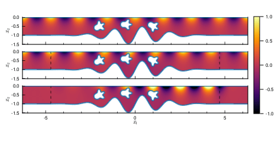

# HarmonicWaterWaves

*Boundary integral equation methods for solving time-harmonic water waves in
Julia*

## Installing

To add this package, type the following code on a Julia REPL:

```julia
using Pkg
Pkg.add(url="https://github.com/maltezfaria/HarmonicWaterWaves.git",rev=v"main")
```

## Usage

Currently, this package is only intended as a reproducibility repository for the
paper [*Complex-scaled boundary integral equation for
time-harmonicwaterwaves*](paper/tex/water-waves-pml.pdf). Run the following code
on a terminal from the root of this repository to regenerate all the figures
presented in the paper:

```bash
julia --project=paper -e 'using Pkg; Pkg.instantiate(); include("paper/makefigures.jl")'
```

**:warning: Because of some (heavy) plotting dependencies that need to be downloaded and
precompiled, the lines above may take some time the first time you run it.**

This will repopulate the [figures](paper/figure) and [animations](paper/animations) folders.
If you have a working `LaTex` installation, you can recompile the
[`paper/tex/water-waves-pml.tex`](paper/tex/water-waves-pml.tex) file to produce the final
`.pdf`. Below is an example of the results produced (see the paper for more
details).

|      Obstacle scattering       |       Step scattering       |
| :----------------------------: | :-------------------------: |
|  |  |
